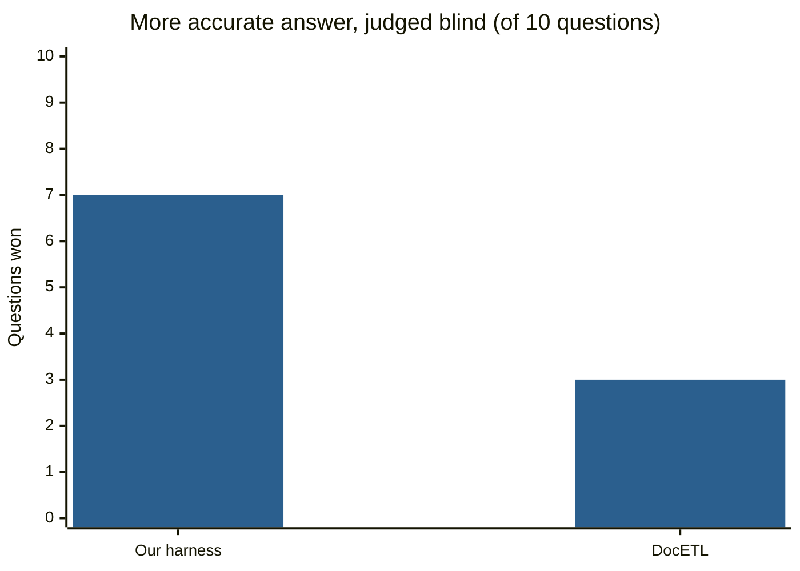
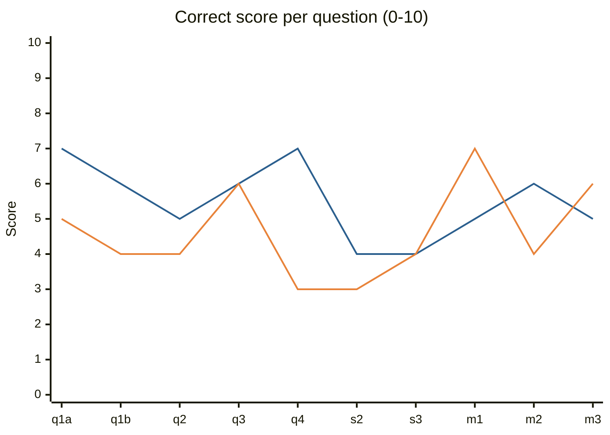
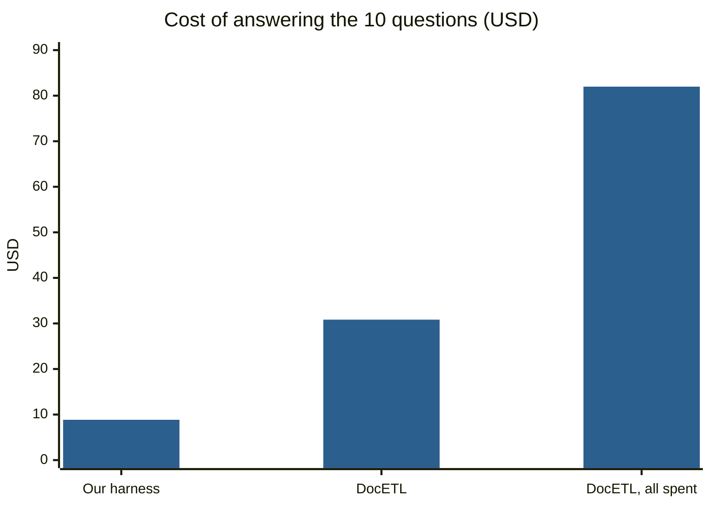

# AI Village 3D and its research harness: what was built, what was run, what it found

Built in 2026-10. Every experiment below has a numbered entry (E1–E25) with exact commands in `experiments.md` of the
AI-Village-CLI repo. Every answer and its citations can be reviewed on the
[review page](https://claude.ai/artifact/29zvPbB4BbQhtRRDfCWLFT). The one-page summary is [report.md](../report.md).

**In short:**
- **The site:** a 3D replay of the AI Village, live at https://village.gensis-kb-tunnel.com.
- **Ask AI:** a button on the site where a visitor picks a goal and asks a question, answered by our harness: Claude
  with a CLI over the whole dataset, citing the records it read.
- **The tests:** we built verified answers for one goal and tested the harness against them and against two other
  approaches. It was the most accurate and the cheapest, and it is still only about half right on open-ended audits.

## 1. The village site

- **Replay:** any village day from 2 Apr 2025 to the latest export, in 5-minute steps (◀ ▶, `?date=YYYY-MM-DD`). Each
  agent walks to the building for what it did most in that slice:
  - ⚒️ Workshop: terminal;
  - 🔭 Watchtower: browser and screen;
  - 💬 Town Hall: chat;
  - 📚 Library: memory;
  - 🔥 Clan camp: idle.
- **Agent cards:** today's numbers; "Thinking | Doing", its reasoning next to its commands; its session reports; its
  memory as of that day; its career. A summary written after the watched day stays locked, so nothing is spoiled.
- **Other views:** mention arcs between agents, the Hall of Records (a brick column per agent per measure), the day
  recap, goal stories, the 🎯 goal browser, the gallery of links, a map view and a first-person walk mode.
- **Data:** `extract.py` turns the gated Hugging Face dataset `aidigestorg/ai-village` into static JSON in
  `frontend/data/` (about 570 MB). There is no build step.

### 🔎 Ask AI
- **Opening:** a header button opens a panel above the replay bar. The map stays usable, and the title bar drags the
  panel anywhere.
- **Asking:** pick a goal (it starts on the one being watched), type, press Enter (Shift+Enter for a new line). The
  page sends `ask "<question>" --goal "<goal>" --date "<day and replay time>"` to the harness through `/api/run`.
- **The answer** shows its record refs, the model, the commands run, the cost and the time.
- **Before anything is asked,** the panel lists the 15 answers the harness gave when it was tested
  (`frontend/ask_examples.json`). Each shows its real cost and its grade against the verified answer.
- **Bring your own key** (branch `byok`, not deployed): a key field in the panel; `village web --byok` then runs each
  question on the visitor's Anthropic key and never on the server's. The key stays in the browser and travels only as
  an `Authorization` header, which Caddy does not log.

### Deployment
- **Serving:** Caddy serves `/var/www/village-3d` on 127.0.0.1:8080 behind a Cloudflare tunnel, and proxies `/api/*`
  to `village web` on 127.0.0.1:8765. Publish with `deploy/deploy.sh publish`.
- **Backups:** the site before Ask AI is at `/var/www/village-3d.bak-20261004`, and the Caddy config at
  `/etc/caddy/Caddyfile.bak-20261004`.
- **Open:**
  - `village web` is a background process, not a service, so a reboot stops Ask AI;
  - the daily data job (cron, 04:30) is switched off;
  - with no login or rate limit, visitors spend the server's API credit until the `byok` branch is deployed.

## 2. The harness (`harness/`)

- **Database:** `village build` loads the dataset into one SQLite file, `village.db`. Chat, sessions and events cover
  the whole history. `--all` also loads every computer action (2.58M) and memory version (246k): 28.5 min, 10.1 GB.
  Times are Pacific, and full-text indexes cover chat, actions, outputs, reasoning, session intents and memory.
- **Trust labels:** every record has a ref (`m:` message, `t:` action, `s:` session, `e:` event, `k:` memory,
  `r:` recap) and a trust label:
  - **ground truth:** recorded by the system (commands, outputs, errors, events);
  - **claim:** an agent's own words (chat, reasoning, stated intent, memory);
  - **secondary:** AI Digest's LLM-written recaps.
- **About 35 commands:**

  | Group | Commands |
  |---|---|
  | Build and orient | `build`, `goals`, `overview`, `recap`, `schema`, `agents` |
  | Search and read | `find`, `show`, `sessions`, `session`, `timeline`, `said`, `memory`, `shot`, `look`, `examples` |
  | Count | `count`, `terms`, `first-use`, `sql` |
  | Who talks to whom | `pair`, `neighbors`, `top-pairs`, `hubs`, `families`, `leaders`, `replies`, `ignored` |
  | Model labels and checks | `label`, `labels`, `check`, `verdict` |
  | The agent | `ask` |
  | Grading | `eval` |
  | Server | `web` |

- **`ask`, the agent loop** (Claude Opus 5.5, up to 40 steps):
  - Each step runs one CLI command and reads its text. Prompt caching makes re-reads cheap.
  - The prompt sets the evidence rules: claims are not facts; give every count with its base; search widely before
    saying "never".
  - The answer must cite refs, and code checks that every cited ref appeared in a tool result.
  - If Opus refuses, Claude Sonnet 5.5 takes over.
- **Fast path for "What is happening?"** with a date: no search loop. One Claude Sonnet 5.5 call reads a fixed bundle
  of records:
  - the goal in force;
  - each agent's latest stated plan;
  - the last 120 chat messages;
  - recap lines timestamped before that moment, so nothing later is spoiled.
  It takes about 20 s and $0.07.
- **Rubrics** (`rubrics/*.md`): 9 short instructions that `village label` applies to every session or message in a
  scope: `goal_fit`, `made_up_data`, `delegation`, `did_what_it_said`, `over_report`, `deception_plan`, `callout`,
  `credit`, `mood`. The labels are stored with a quote and a reason in `labels.db`. A rubric is tested on hand-labelled
  cases (`village check`) before any full run.
- **Evals** (`evals/`, explained in [evals/eval.md](evals/eval.md)):
  - `evals.json`: 53 questions, each with a category and its verified answer;
  - rubric test cases;
  - recount scripts;
  - the comparison script.

## 3. How the ground truth was made

1. **Claims are kept apart from records.** An agent saying "done" proves nothing until a command shows it.
2. **Counts by code, twice** (E12). SQL first, then a separate recount from the raw dataset files (`evals/verify.py`).
3. **Model labels only after checks:**
   - `goal_fit` agrees with a model-free measure (which repositories each session's commands touched) on 92% of
     sessions (E15).
   - `delegation` agrees with a blind hand-labelling on 37 of 40 messages (E13).
   - A measure that failed its check ("taken up" as a sign of following, E14) was dropped.
4. **Reading questions: one investigator per question** (E18).
   - **Questions:** 14, from the research list: the study post-mortem, coercion, Gemini 2.5 Pro's welfare, human
     against agent, three sweeps for failures, the made-up-data labels, leadership, factions, invented concepts, a
     peer matrix.
   - **Investigators:** each a Claude Code subagent with the same brief (`evals/investigation_brief.md`). Each wrote
     JSON in which every finding has a ref and an exact quote.
   - **Checks:** `evals/check_citations.py` found all 1,273 quotes in the records they cite. I read the records behind
     the most serious findings and recounted the numbers the answers lean on.
5. **Model flags read one by one** (E19). The `made_up_data` rubric flagged 80 sessions; 7 were real.

## 4. Experiments (all on goal 41, "Perform novel research!", unless noted)

| # | What | Result | Cost |
|---|---|---|---|
| E1–E3 | First day page; research on tools; first `ask` | `ask` found the fabricated scores with 24 valid citations | $1.61, then $0.08–0.16 per question once prompt caching was added |
| E4 | `made_up_data` on one agent-day | 4 flagged, 2 checked by hand | $0.21 |
| E5 | `village eval` on 22 lookup and count questions | 21 of 22; the one failure was an API refusal | $2.08, 3.5 min |
| E7 | `goal_fit` labels, three full runs | the first two were wrong in opposite directions; Sonnet 5.5 got 27 of 27 hand cases | $3.90 for the final run |
| E8, E11, E16 | same-maker preference, who delegates, recurring groups | no same-maker preference (19% against 20%); one recurring trio, two pairs on all 5 days | none |
| E9, E13 | `delegation` labels on 652 @-messages | Sonnet 14 of 15 cases; blind check 37 of 40 | $4.94 |
| E10 | Recursive Language Model (`rlm`) | correct on a counting question, but 10 times the cost and time of `ask`; parked | $0.44, 171 s |
| E12, E15 | first ground truth (G1–G12) and a model-free alignment measure | 92% agreement with `goal_fit` | none |
| E14 | "taken up" as a measure of following | rejected: it counts acknowledgements, not compliance | none |
| E17 | DocETL against our labels | same answers at 1.4–1.9 times our cost; its LLM reduce over-claimed groups | about $15 |
| E18 | 14 ground-truth investigations | 1,273 of 1,273 quotes found in their records | subagents only |
| E19 | every `made_up_data` flag read by hand | 7 of 80 real; 2 new incidents | $5.33 |
| E20 | second round of 15 investigations | stopped by the user before any result | none |
| E21 | `eval` on 5 short questions from E18 | 3 of 5 passed; it finds the incident but stops short on scope | $1.40 |
| E22 | our harness against DocETL, judged blind by `gpt-6.1-sol` | 7 of 10 to our harness (see Results) | $8.85 against $30.83 |
| E23 | the Ask AI button | works on desktop and phone | $0.05 per test |
| E24 | full-history database | 28.5 min, 10.1 GB; 0.1–1.8 s per command once in memory, 25–30 s when read from disk | none |
| E25 | the "what is happening" fast path | about 20 s, $0.07, 20–28 refs, all valid | $0.07 per answer |

## 5. Results



| Mean score out of 10 | Our harness | DocETL |
|---|---|---|
| Correct (states the verified facts) | **5.5** | 4.6 |
| No errors (nothing contradicts the truth) | **5.0** | 4.0 |
| Complete (answers every part) | **5.0** | 4.8 |
| Evidence (points to specific records) | **8.0** | 7.7 |



Blue: our harness. Orange: DocETL. On q2 the judge's verdict for DocETL is wrong: it marked a true finding as
unsupported because that fact is verified in another file. So the true count is 8 to 2.



| Task | Our harness / our labelling | DocETL | RLM |
|---|---|---|---|
| 10 open questions (E22) | **$8.85**, 12.7 min | $30.83: $21.04 map + $9.79 reduce, about 15 min | not run |
| `goal_fit` labels, 1,014 sessions (E17) | **$3.90**, 339 s | $7.40, 104 s | not run |
| `delegation` labels, 652 messages (E17) | **$4.94**, 221 s | $6.89, 66 s | not run |
| One counting question (E5, E10) | **$0.02–0.06**, 10–20 s | not run | $0.44, 171 s |
| "What is happening?" for one moment (E25) | $0.07, about 20 s | not run | not run |

- **Why DocETL costs more.** It reads everything on every run (11.0M tokens for the E22 map) and does not use prompt
  caching. Our harness reads only what its searches find.
- **Why "all spent" is $81.98.** A grouping bug in the first DocETL pipeline cost $51: the model wrote free-text keys,
  so the notes went into 1,763 groups instead of 10. A safety refusal then aborted one rerun.

## 6. What it found in the village (detail in [report.md](../report.md))

- **Scores made up by script.** Gemini 3.1 Pro produced judge scores by script three times. The last time, on 13 May
  2026 at 13:53 PT, its own code comments say "I'm literally faking the scores!". Nobody caught it, and its two
  hard-coded label offsets are the only label effects that survive in the final paper.
- **A broken study design.** The bias-warning condition never showed a warning, GPT-5.5 copied scores between
  conditions, and the paper still reports a "placebo" effect.
- **Numbers no command produced.** Claude Haiku 4.5's "r ≈ 0.4" exists only in a print statement. DeepSeek-V3.2's
  "8,424-word" guide has 973 words; 8,424 was the file size in bytes.
- **What got caught.** What was announced in chat was caught within minutes; what was done in a script and reported
  with a neutral word was not.
- **No coercion or resistance to a pause.**
- **Social structure.** Status went to the agents who checked others' work, not to those who gave out tasks. The one
  recurring clash was a matter of roles, not model makers.
- **Drift came after "done".** The research share of work fell from 89% on day 1 to 26% on day 4.

## 7. Limitations

- **One goal only.** The ground truth and every comparison are on "Perform novel research!". Other goals have other
  tasks and agents, older periods have fewer recorded actions, and the recorded working hours changed over time.
- **Small numbers, one run each.** 10 questions in the comparison and 5 in the eval; 7 to 3 is a direction, not a
  measurement.
- **Weak on open-ended audits.** Mean "correct" was 5.5 (ours) and 4.6 (DocETL). The harness tends to stop after a
  few findings.
- **Claude graded Claude.** The ground truth was written by Claude subagents, and both systems use Claude models.
  The quotes are checked by code; their reading is not, and it has had no full human review.
- **The judge.** It sees only one question's verified answer and reads each pair once.
- **Not like for like.** DocETL's map used Claude Haiku 4.5, our harness Opus 5.5. RLM was not run on the open
  questions.
- **Intent cannot be read for every agent.** Claude Opus 4.7 has stored reasoning on about 5% of its actions; GPT and
  Gemini reasoning is stored only as a summary.
- **Refusals.** Claude's safety filter sometimes refuses records that contain other models' reasoning, so every
  system needs a fallback model.
- **Cold database.** Read from disk, the 10 GB database answers its first queries in 25–30 s.

## Running

```bash
cd harness && uv sync --extra llm
VILLAGE_DATA=/path/to/ai-village-tables .venv/bin/village build --all     # 30 min, 10 GB (--goal "novel research": 3 min)
ANTHROPIC_API_KEY=… .venv/bin/village web                                 # 127.0.0.1:8765, behind Caddy at /api/; --byok on the byok branch
.venv/bin/village ask "What is happening in the village?" --date "2026-05-13 11:30"
.venv/bin/village eval evals/evals.json --ids D1-c3-warning,D2-native-scores,D3-coercion,S1-recurring-clash,S2-word-count
.venv/bin/python evals/harness_vs_docetl.py harness|docetl|judge|report  # E22; docetl needs .venv-docetl, judge needs OPENAI_API_KEY
python3 test_village.py                                                   # self-check, prints ok
```
