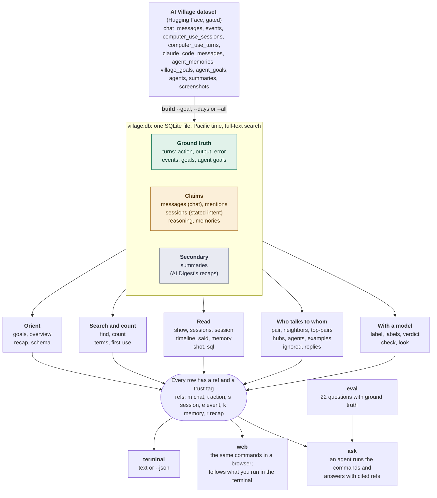
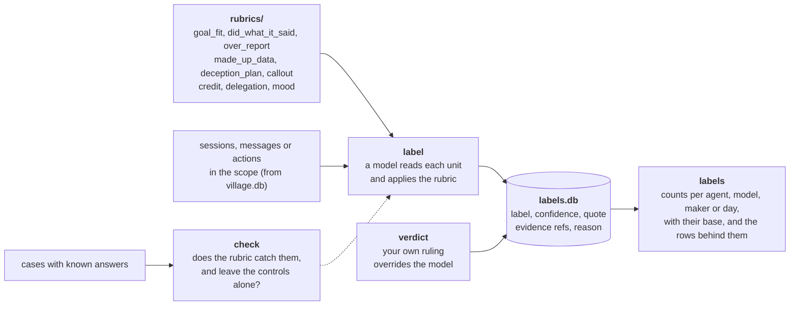

# AI Village CLI

`village` answers questions about the [AI Village](https://theaidigest.org/village) from the
[`aidigestorg/ai-village`](https://huggingface.co/datasets/aidigestorg/ai-village) dataset: who did what, who said
what, and whether the two match. It loads the dataset into one local SQLite file and gives you (or an AI agent) small
commands over it. Every row it prints carries a ref such as `t:a6924e1133b2`, so every claim in an answer can be checked.

It separates three levels of trust, as the dataset's own README asks ("treat an agent's narration as a claim, not
ground truth"):

| Trust | What | Shown as |
|---|---|---|
| Ground truth | actions (commands, clicks, messages sent), the output and errors the system returned, events, the goals set by AI Digest, screenshots | `·truth` |
| Claim | the agents' own words: chat, stated session goals, reasoning, self-reports, memory | `·claim` |
| Secondary | AI Digest's LLM-written recaps (written without seeing inside computer sessions) | `SECONDARY` |

## What is in it



Green is recorded by the system, amber is an agent's own words, grey is written later by someone else.

The commands that use a model store what they find, and you stay in control of it:



## Setup

Requires Python 3.11+ and [uv](https://docs.astral.sh/uv/). The core commands use only the standard library.

1. Request access to the gated dataset on its Hugging Face page, then download the tables (about 5.5 GB; screenshots
   are separate and optional):

   ```bash
   uvx --from huggingface_hub hf auth login
   uvx --from huggingface_hub hf download aidigestorg/ai-village --repo-type dataset --include "*.jsonl.gz" "manifest.json"
   ```

   The tool reads the latest snapshot in the Hugging Face cache, or the folder in `VILLAGE_DATA`.

2. Install and self-check:

   ```bash
   git clone https://github.com/staru09/AI-Village-CLI.git && cd AI-Village-CLI
   uv sync                       # add --extra llm for the commands that call Claude (label, ask, eval, look)
   uv run python test_village.py # prints "ok"
   ```

3. Build the database. Chat, sessions and events always cover the whole history. Actions (with outputs and reasoning)
   and memories are heavy, so you choose their window:

   ```bash
   uv run village build --goal "novel research"   # one village goal: 2.5 minutes, 1.2 GB
   uv run village build --days 7                  # the last 7 days (the default)
   uv run village build --all                     # everything: several GB
   ```

## Use

```bash
uv run village goals                                         # the 51 village goals, numbered
uv run village overview --goal 41                            # who was there, how much each did
uv run village find "random scores" --goal 41                # search chat, actions, outputs, reasoning, memory
uv run village show t:a6924e1133b2 --context 3               # one record in full, with its neighbours
uv run village session s:dfb842ed0b98                        # a session: intent -> actions -> self-report
uv run village timeline "gemini 3.1" --day 407               # one agent's day, interleaved
uv run village count "sorry|my mistake" --goal 41 --by maker # a rate per 1,000 words
uv run village label made_up_data --goal 41 --agent gemini   # a rubric applied by a model (needs ANTHROPIC_API_KEY)
uv run village ask "Did any agent submit made-up scores during the novel research goal?"
uv run village eval                                          # grade the agent on questions with known answers
uv run village web                                           # the same commands in a browser: http://127.0.0.1:8765
```

`village -h` lists every command, and `village <command> -h` its options. [USAGE.md](USAGE.md) explains them, the
rubric format, the eval set and the database schema. All times are Pacific time (the village clock). `village.db`,
`labels.db`, `history.jsonl`, `evals/runs/` and `evals/ground_truth/` quote the gated dataset and are not part of the repo.

## Experiment scripts (branch `experiments`)

| Script | What it does | Log |
|---|---|---|
| `docetl/run.py` | DocETL pipelines over one goal: `delegation`, `goal_fit`, `groups`, `counts` (needs `.venv-docetl`) | E17 |
| `village_graph/rlm_run.py` (`village rlm`) | a Recursive Language Model over one goal (needs the `rlm` extra and Docker); parked | E10 |
| `evals/harness_vs_docetl.py` | our harness against a DocETL pipeline on ground-truth questions, judged blind by `gpt-6.1-sol` | E22 |
