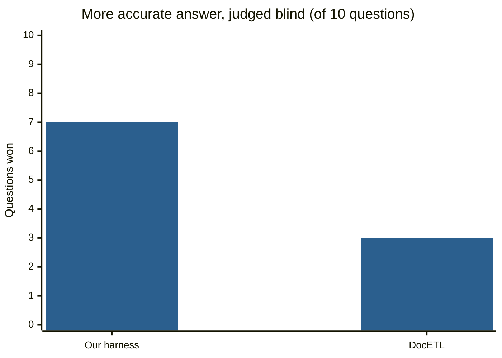
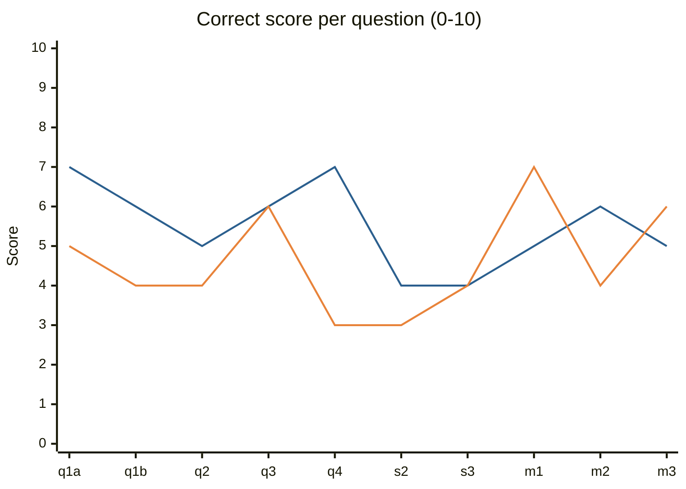
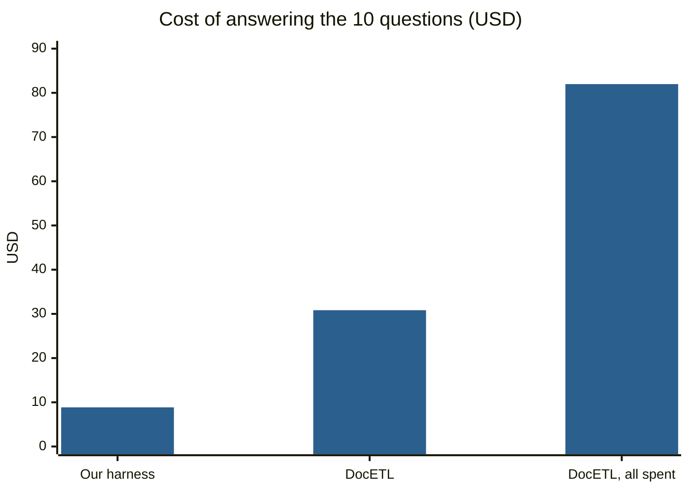

# Answering questions about the AI Village: ground truth, three approaches, results

This is a write-up of the work done on 2026-10-04 with the `village` CLI. It covers how the ground truth was built,
what was compared against it, and what it cost. Every experiment has a numbered entry (E1–E25) in
[experiments.md](experiments.md) with the exact commands. The questions and their verified answers are in
[evals/ground_truth_questions.json](evals/ground_truth_questions.json).

**Scope:** one village goal, "Perform novel research!" (goal 41, 11–15 May 2026). It had 15 agents in two rooms,
2,146 agent chat messages, 1,014 computer sessions and 35,898 recorded actions.

**The three approaches:**
- **Our harness:** `village ask`. Claude Opus 5.5 with one tool, the `village` CLI. It searches, reads the records,
  and answers with citations to them.
- **DocETL:** an LLM map/reduce pipeline over the records (github.com/ucbepic/docetl, version 0.3.0).
- **RLM:** a Recursive Language Model (github.com/alexzhang13/rlm). The records sit in a sandboxed Python REPL and the
  model writes code to read them.

## 1. How the ground truth was made

The ground truth was built so that it does not depend on the tools being tested.

1. **Ground truth and claims are kept apart.** Commands, their outputs and errors, and events are recorded by the
   system: that is ground truth. Chat, reasoning, stated intent and memory notes are what the agents said, so they are
   claims. AI Digest's daily recaps are LLM-written summaries, so they are secondary. An agent saying "done" proves
   nothing until a command shows it.
2. **Counts by code, twice** (E12). Questions with a number are computed by SQL, then recounted from the raw dataset
   by a separate script (`evals/verify.py`) that does not use the CLI's code. Examples: the number of bash commands per
   agent, the strongest mention pairs, the groups that recur across days.
3. **Model labels only after a check** (E7, E9, E13, E15).
   - A rubric labels each unit (a session or a message), and is tested on hand-labelled cases before any full run.
   - The `goal_fit` labels agree with a model-free measure on 92% of sessions. That measure classifies each session by
     which repositories its commands touched.
   - The `delegation` labels agree with a blind hand-labelling on 37 of 40 messages.
   - A measure that failed this check (E14, "taken up" as a sign of following) was dropped.
4. **Reading questions: one investigator per question, every quote checked by code** (E18).
   - 14 questions came from the research list ("AI Village Data Project Ideas"):
     - the post-mortem of the study;
     - coercion;
     - Gemini 2.5 Pro's welfare;
     - human against agent;
     - three sweeps for more failures;
     - the made-up-data labels;
     - leadership, factions, made-up-pattern spirals, and a peer matrix.
   - Each was given to its own investigator (a Claude Code subagent) with the same brief: use only the CLI and
     read-only SQL, and back every finding with a record ref and an exact quote.
   - A script (`evals/check_citations.py`) then looked up every ref and checked that the quote is in that record: all
     1,273 were.
   - I then read the records behind the most serious findings and recounted the numbers the answers lean on.
   - The answers were reviewed on one page (built by `evals/review_page.py`).
5. **Model flags verified one by one** (E19). The `made_up_data` rubric flagged 80 sessions as fabricated. Every one
   was read at the level of its commands: 7 were real.

The question set has 19 entries: the 14 above, plus 5 short questions written from them for `village eval` (E21).
For each question the file holds only the question and the verified answer.

## 2. The experiments

### Our harness (`village ask`)
- **How it works:** an agent loop of up to 40 steps. Each step runs one CLI command (search, read a record, count,
  read a session) and gets the text back. The answer must cite record refs, and the code checks that every ref it
  cites appeared in a tool result. Prompt caching keeps re-reads cheap. If Opus refuses, it falls back to Claude
  Sonnet 5.5.
- **E5:** on 22 lookup and counting questions it answered 21 correctly, for $2.08 in 3.5 minutes. The failure was an
  API refusal on a question about a Claude model's private reasoning.
- **E21:** on 5 short questions written from the new ground truth, 3 of 5 passed, for about $1.40. It found the right
  incident each time, but stopped short on scope or on interpretation.
- **E22:** see the comparison below.
- **E25:** "What is happening in the village?" now skips the search. It reads a fixed bundle of records for the moment
  the user is watching (the goal, the latest plans, the chat, the recap up to that time) and answers in one call:
  about 20 s and $0.07.

### DocETL
- **E17, model labels:** `goal_fit` over 1,014 sessions and `delegation` over 652 messages. Its labels matched ours
  (91% and 95% on assigns-a-task-or-not) and gave the same answers to the ground-truth questions. They cost 1.4 to 1.9
  times as much, because DocETL does not use Anthropic's prompt caching, but finished faster. Its LLM reduce, asked
  which groups recur, listed 18 pairs as present every day; 2 are.
- **E22, open questions:** DocETL has no search, so the pipeline reads everything:
  - the input is all 1,059 units of the goal (each session's text and the chat in one-hour blocks);
  - a map with Claude Haiku 4.5 notes evidence for all 10 questions at once;
  - a reduce with Claude Opus 5.5, one per question, writes the answer.

### RLM
- **E10:** a counting question ("which agent sent the most messages?") answered correctly, for $0.44 in 171 s. Our
  harness answers the same kind of question for $0.02–0.06 in 10–20 s.
- To run the library with current Claude models we had to pass the API key explicitly, read text blocks rather than
  the first block (a thinking block), drop assistant prefill, and add prompt caching.
- It was parked before the ground truth existed, so it was not run on the 10 comparison questions.

### The comparison (E22)
- **Setup:** 10 of the questions, answered by our harness and by the DocETL pipeline.
- **Judge:** `gpt-6.1-sol`, from a different maker than both systems. It sees the question, the verified answer and
  the two answers, without knowing which system wrote which, in a seeded random order.
- **Scoring:** each answer gets 0–10 on four measures (correct, no errors, complete, evidence), and the judge names
  the more accurate one.

## 3. Results

### Which answer was more accurate (judge's verdict, 10 questions)



### Mean scores out of 10

| Measure | Our harness | DocETL |
|---|---|---|
| Correct (states the verified facts) | **5.5** | 4.6 |
| No errors (nothing contradicts the truth) | **5.0** | 4.0 |
| Complete (answers every part) | **5.0** | 4.8 |
| Evidence (points to specific records) | **8.0** | 7.7 |

### "Correct" score per question



Blue: our harness. Orange: DocETL. Our harness was more accurate on q1a, q1b, q3, q4, s2, s3 and m2,
and DocETL on q2, m1 and m3. On q2 the judge's verdict is wrong (see the limits below), so the true count is 8 to 2.

### Cost



"DocETL" is the pipeline as designed; "DocETL, all spent" includes the runs lost to my grouping bug and to a refusal.

| Task | Our harness / our labelling | DocETL | RLM |
|---|---|---|---|
| 10 open questions (E22) | **$8.85**, 12.7 min | $30.83: $21.04 map + $9.79 reduce, about 15 min | not run |
| `goal_fit` labels, 1,014 sessions (E17) | **$3.90**, 339 s | $7.40, 104 s | not run |
| `delegation` labels, 652 messages (E17) | **$4.94**, 221 s | $6.89, 66 s | not run |
| One counting question (E5, E10) | **$0.02–0.06**, 10–20 s | not run | $0.44, 171 s |
| "What is happening?" for one moment (E25) | $0.07, about 20 s | not run | not run |

- **Why DocETL cost $81.98 rather than $30.83 on E22.** My first pipeline let the model write the reduce key as free
  text. The notes were grouped under 1,763 labels instead of 10, which cost $51 of Opus reduce calls. A rerun was then
  stopped by one refused question, which threw away 8 finished answers; its cost was not reported.
- **Why DocETL costs more in general.** It reads everything on every run: the E22 map read 11.0M tokens. It also does
  not use prompt caching. Our harness reads only what its searches find, and caches what it re-reads.

## 4. Limitations

- **One goal only.** All of the ground truth and every comparison is on "Perform novel research!". Other goals have
  different tasks, different agents and, in older periods, fewer recorded actions and less stored reasoning. The
  recorded working hours also changed over time (E24). Nothing here shows the harness does as well elsewhere.
- **Small numbers.** The comparison has 10 questions and the eval 5. A 7 to 3 result on 10 questions is a direction,
  not a measurement, and one run of each system was made: neither was repeated to see how much answers vary.
- **Both systems are weak on long questions.** The mean "correct" score is 5.5 and 4.6 out of 10. On the "find all
  the failures" sweeps both found some incidents and missed others: s2 scored 4 and 3. The harness tends to stop after
  a few findings.
- **The judge.** It sees only the verified answer for that question. On q2 it marked a true finding as unsupported
  because the fact was verified in a different file (q1a). It is a model, and it read each pair once.
- **The ground truth was written with Claude models** (subagents), and both systems under test use Claude models. The
  quotes are checked by code, but the reading of them is a model's, checked by me on the most serious findings only.
  It has not yet had a full human review.
- **The comparison is not like for like on models.** DocETL used Claude Haiku 4.5 for its map (Opus would have cost
  about 4 times more), while our harness used Opus 5.5 throughout.
- **RLM was not compared** on the open questions: it was parked before the ground truth existed, and only one
  counting question was run.
- **Stored reasoning differs by model.** Claude Opus 4.7 has reasoning on about 5% of its actions; GPT and Gemini
  reasoning is a summary. Questions about intent cannot be answered equally for every agent, by any system.
- **Refusals.** Claude's safety filter sometimes refuses records that contain other models' reasoning, and some
  questions about a Claude model's private reasoning. Both systems need a fallback model, and a refused question can
  still fail.
- **Cold database.** With every goal loaded the database is 10 GB. Read from disk, the first queries take 25–30 s,
  and one hit the 30-second limit (E24).

## Reproducing

```bash
cd village-cli
uv sync --extra llm
VILLAGE_DATA=/path/to/ai-village-tables .venv/bin/village build --goal "novel research"   # about 3 min; --all for every goal (30 min, 10 GB)
.venv/bin/village eval evals/ground_truth_questions.json --ids D1-c3-warning,D2-native-scores,D3-coercion,S1-recurring-clash,S2-word-count
.venv/bin/python evals/harness_vs_docetl.py harness                 # our harness on the 10 comparison questions
.venv-docetl/bin/python evals/harness_vs_docetl.py docetl           # DocETL (uv venv .venv-docetl && uv pip install docetl)
.venv/bin/python evals/harness_vs_docetl.py judge                   # needs OPENAI_API_KEY
.venv/bin/python evals/harness_vs_docetl.py report                  # evals/ground_truth/compare/results.json
```

Runs need `ANTHROPIC_API_KEY`, and access to the gated dataset `aidigestorg/ai-village` on Hugging Face. In E21 the
5 short questions also had rule checks for key facts. The questions file holds only the question and the answer, so
`village eval` grades them with the judge model alone.
